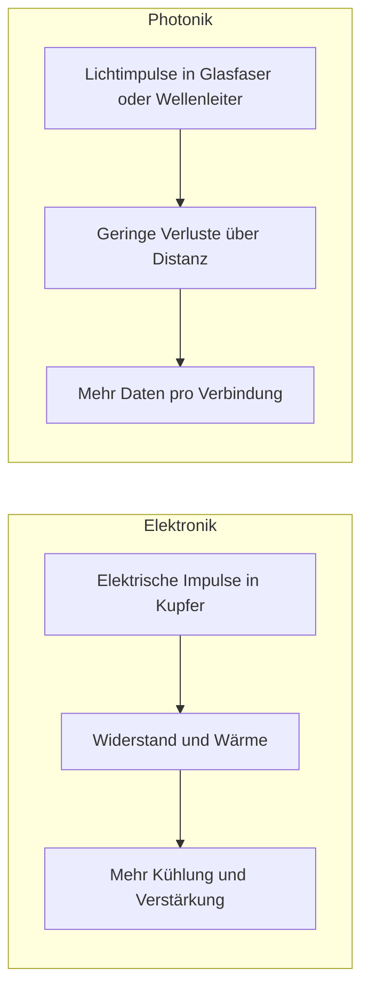

# Photonik einfach erklärt

Stand: Mai 2026.

## Kurzüberblick

Photonik ist, einfach gesagt, die technische Nutzung von Licht. Gemeint sind nicht nur Lampen oder Laser, sondern alle Verfahren, mit denen Licht erzeugt, gelenkt, verändert und ausgewertet wird. Diese Technik steckt heute schon im Internet über Glasfaser, in Kameras und Sensoren, in medizinischer Bildgebung, in LED-Beleuchtung und zunehmend auch in Chips für Datenübertragung und Messaufgaben. Nach der Definition der entity["organization","Europäische Kommission","Exekutivorgan der Europäischen Union"] umfasst Photonik das Erzeugen, Führen, Manipulieren, Verstärken und Erkennen von Licht; das entity["organization","Bundesministerium für Forschung, Technologie und Raumfahrt","deutsches Bundesministerium"] beschreibt Photonik entsprechend als Forschung an Photonen und ihre Überführung in Technologien. citeturn5search4turn5search5turn4view5turn16search13

Elektronik und Photonik sind dabei keine Gegensätze. In der Praxis ergänzen sie sich: Elektronik steuert, rechnet und speichert; Photonik transportiert Informationen sehr schnell, misst sehr präzise und spart bei bestimmten Aufgaben Energie und Kühlung. Gerade weil Datenmengen, KI-Lasten, Automatisierung, Mobilität und Gesundheitsdiagnostik wachsen, wird Photonik wichtiger. Offizielle und industrienahe Quellen beschreiben integrierte Photonik deshalb immer häufiger als Schlüsseltechnik für Kommunikation, Sensorik, Rechenzentren, Gesundheit und Quantentechnologien. citeturn21search1turn10view0turn15search5turn29view0

Die grobe Zeiteinteilung ist heute schon erkennbar: Telekommunikation und LED-Beleuchtung sind längst breit im Einsatz; optische Verbindungen in Rechenzentren sowie kompaktere LiDAR- und Sensorsysteme im Fahrzeug wachsen in den späten 2020er Jahren stark; neue photonische Diagnosechips in der Routineversorgung brauchen meist länger, oft bis in die 2030er Jahre. Bei Quantenphotonik und photonischem Rechnen gibt es sichtbare Fortschritte, aber noch keine belastbaren Termine für einen breiten Massenmarkt. Diese Zeithorizonte sind daher realistische Einordnungen, keine festen Marktversprechen. citeturn20view1turn26search0turn31view0turn19view0turn32view0

## Was Photonik ist

Wenn man es auf einen Satz reduzieren will, dann ist Photonik „Elektronik mit Licht“. Während Elektronik elektrische Ladungen durch Leitungen und Bauteile bewegt, arbeitet Photonik mit Lichtteilchen, also Photonen. Dieses Licht kann sichtbar sein, oft ist es aber auch unsichtbar, zum Beispiel Infrarotlicht in Glasfasern oder in Abstandssensoren. Genau deshalb begegnet man Photonik ständig, ohne sie direkt zu bemerken. citeturn5search4turn5search5turn4view5

Ein paar Begriffe helfen beim Einstieg. Ein **Photon** ist ein „Lichtpaket“. Eine **Glasfaser** ist ein sehr dünner Lichtleiter aus Glas. Ein **Sensor** ist ein Messfühler; ein photonischer Sensor nutzt Licht, um etwa Abstand, Temperatur, Stoffe oder Biomarker zu erkennen. Ein **PIC** – eine photonisch integrierte Schaltung – ist vereinfacht ein „Licht-Schaltkreis auf einem Chip“, auf dem mehrere optische Funktionen eng zusammenrücken. citeturn21search3turn15search5turn32view0

Wichtig ist auch: Photonik bedeutet nicht automatisch „Science-Fiction“. Vieles ist sehr alltagsnah. Das Internet beruht seit langem auf optischer Datenübertragung. Smartphone-Kameras, Displays und Sensoren sind auf photonische Komponenten angewiesen. In der Medizin helfen lichtbasierte Verfahren, Gewebe schonend sichtbar zu machen oder Proben schnell zu analysieren. In der Industrie dienen Laser als präzise Werkzeuge für Fertigung und Messung. citeturn4view5turn31view0turn22search9

## Wie Photonik arbeitet

Konzeptionell lässt sich Photonik in vier einfache Schritte zerlegen: Licht **erzeugen**, Licht **formen**, Licht **transportieren** und Licht **auslesen**. Ein Laser oder eine LED erzeugt Licht. Linsen, Spiegel oder winzige Strukturen auf einem Chip formen es. Glasfasern oder mikroskopische Wellenleiter führen es an den Zielort. Sensoren oder Detektoren lesen schließlich aus, was das Licht unterwegs „gesehen“ oder transportiert hat. Das ist die Grundlogik hinter Glasfasern, LiDAR, medizinischer Bildgebung und vielen photonischen Chips. citeturn5search4turn21search3turn15search5

Eine gute Alltagsanalogie ist Morsecode mit Licht. Stellen Sie sich vor, Sie schicken durch einen klaren Tunnel sehr schnelle Lichtblitze: an, aus, an, an, aus. Schon diese Helligkeitswechsel tragen Information. In einer Glasfaser passiert im Kern genau so etwas – nur viel schneller und viel präziser. Auf einem Chip passiert dasselbe auf winzigem Raum in miniaturisierten Lichtwegen, den sogenannten Wellenleitern. citeturn21search1turn21search3turn15search5

Der große Unterschied zur Elektronik liegt nicht darin, dass Licht „magisch“ wäre, sondern darin, dass es für manche Aufgaben besser passt. Über längere Strecken und bei sehr hohen Datenraten haben optische Verbindungen große Vorteile bei Kapazität, Reichweite und Energieeffizienz. Der entity["organization","VDE","deutscher Verband für Elektrotechnik, Elektronik und Informationstechnik"] verweist für künftige KI-Rechenzentren auf extrem hohe Datenraten und darauf, dass integrierte Photonik dort Wärmeverluste und Energieaufnahme senken kann. Gleichzeitig gilt: Reale Systeme mischen fast immer optische und elektrische Schritte, statt alles nur mit Licht zu machen. citeturn21search1turn10view0turn26search6turn29view0

Die Skizze ist bewusst vereinfacht: In echten Geräten greifen elektronische und optische Bauteile oft eng ineinander, besonders bei photonischen Chips und in Rechenzentren. citeturn27view0turn29view0

## Wo Photonik heute schon drinsteckt

In der **Telekommunikation** ist Photonik längst Alltag. Glasfaser ist das Rückgrat des Internets. Offizielle und industrielle Quellen beschreiben optische Kommunikation wegen ihrer hohen Kapazität, Reichweite und Energieeffizienz seit Jahren als Grundpfeiler der Digitalisierung. Die nächste Stufe ist die stärkere Integration optischer Funktionen direkt in Transceiver und Chips, damit Daten auch in Rechenzentren und computernahen Verbindungen effizienter bewegt werden können. citeturn21search1turn21search5turn20view1turn10view0

In **medizinischen Geräten** ist Photonik ebenfalls fest verankert, allerdings sehr unterschiedlich je nach Anwendung. Lichtbasierte Bildgebung, Endoskopie und Spektroskopie sind etablierte Felder. Gleichzeitig arbeiten Institute wie das entity["organization","Leibniz-Institut für Photonische Technologien","deutsches Forschungsinstitut für Photonik in Jena"] und mehrere Fraunhofer-Institute an patientennahen Tests, kompakten Diagnosesystemen und photonischen Biosensoren für Notaufnahme, Praxis und Labor. Besonders reizvoll ist hier, dass dieselbe Grundtechnik sowohl schnell als auch schonend messen kann. citeturn31view0turn30search3turn30search11turn27view1

Bei **Sensoren** ist Photonik fast überall dort stark, wo man präzise, schnell oder berührungslos messen will. Ein gutes Beispiel ist LiDAR, also Abstandsmessung mit Laserlicht. In Fahrzeugen unterstützt LiDAR Fahrerassistenz und automatisiertes Fahren. In Infrastruktur und Industrie messen faseroptische Sensoren gleichzeitig Kraft, Druck, Temperatur und Dehnung; laut Roadmaps werden solche Systeme bereits in Luftfahrt und Bauwerken wie Brücken genutzt. citeturn4view8turn4view9turn19view0

Bei **Beleuchtung** ist Photonik vielleicht am sichtbarsten. Effiziente LED-Systeme sind heute Standard, und die Kombination aus Lichtquelle, Sensorik und Steuerung macht Gebäude und Städte sparsamer. Die entity["organization","Europäische Kommission","Exekutivorgan der Europäischen Union"] verweist darauf, dass Beleuchtung weltweit rund 19 Prozent des Stromverbrauchs ausmacht und effizientere Lichttechnik daher große Einsparungen ermöglicht. citeturn16search13turn16search12

In **Fertigung und Computing** ist Photonik oft weniger sichtbar, aber besonders wichtig. Laser erlauben präzise, flexible und ressourcenschonende Produktionsprozesse. Gleichzeitig werden optische Verbindungen in Rechenzentren, photonische Prozessorkonzepte und photonic integrated circuits immer relevanter, weil klassische elektrische Verbindungen bei Datenmenge, Wärme und Energie an Grenzen stoßen. citeturn22search9turn22search3turn10view0turn15search5

| Anwendung | Alltagsnahes Beispiel | Hauptnutzen | Reifegrad heute |
|---|---|---|---|
| Telekommunikation und Glasfaser | Internet-Backbone, Hausanschlüsse, Netzknoten | sehr hohe Kapazität, lange Strecken, geringe Verluste | **hoch** citeturn21search1turn21search5turn20view1 |
| Rechenzentren und optische Verbindungen | Server-zu-Server- und Chip-nahe Datenwege | mehr Bandbreite, weniger Wärme, niedrigere Latenz | **mittel bis hoch** citeturn10view0turn4view11turn26search0turn4view12 |
| Medizin und Diagnostik | Bildgebung, Endoskopie, patientennahe Tests | schonender, schneller, präziser | **mittel** citeturn31view0turn30search3turn27view1 |
| Sensorik und LiDAR | Abstandsmessung im Auto, Strukturüberwachung | berührungslos, genau, kompakt | **mittel** citeturn4view8turn4view9turn19view0 |
| Beleuchtung | LED-Leuchten, smarte Gebäude | große Energieeinsparung, bessere Steuerbarkeit | **hoch** citeturn16search13turn16search12 |
| Fertigung | Laserbearbeitung, additive Fertigung | präzise, flexibel, materialschonend | **hoch** citeturn22search9turn22search3 |
| Quantenphotonik und photonisches Rechnen | Pilotanlagen, Forschungsdemonstratoren | potenziell sehr schnell, netzwerkfähig, präzise | **früh** citeturn12search3turn12search11turn32view0 |

Die Reifegrade sind eine redaktionelle Einordnung auf Basis der zitierten Quellen: **hoch** bedeutet breit im Einsatz, **mittel** ein wachsender Markt mit klaren Anwendungen, **früh** steht für Pilot- oder frühe Kommerzialisierungsphase.

## Warum Photonik wichtiger wird

Der wichtigste Treiber ist die **Datenmenge**. Je mehr Streaming, Cloud, KI und vernetzte Industrie zunehmen, desto mehr gerät rein elektrische Datenübertragung unter Druck. Der entity["organization","VDE","deutscher Verband für Elektrotechnik, Elektronik und Informationstechnik"] argumentiert deshalb, dass Rechenzentren für kommende Lasten deutlich mehr optische Technik brauchen. Photonics21 betont zusätzlich, dass co-packaged optics – also Lichtverbindungen direkt am oder im Chipgehäuse – den Schritt von „nur schneller“ zu „schneller und sparsamer“ ermöglichen sollen. citeturn10view0turn26search0turn26search4turn4view12

Der zweite große Treiber ist **Energieeffizienz**. Nicht jede photonische Lösung spart automatisch Strom. Aber dort, wo Daten weit, schnell oder parallel bewegt werden müssen, ist das Einsparpotenzial groß: weniger Umwandlungen, weniger Wärme, weniger Kühlbedarf. Derselbe Grund gilt für Beleuchtung. Effizientere Lichtquellen und sensorbasierte Steuerung sparen nicht nur Strom, sondern senken auch Betriebskosten in Gebäuden, Industrie und Logistik. citeturn10view0turn26search6turn16search13turn16search12

Der dritte Treiber ist **Gesundheit**. Licht kann Gewebe und Proben untersuchen, ohne mechanisch einzugreifen. Genau deshalb ist Photonik für patientennahe Tests, Tumordiagnostik, Infektionsdiagnostik und bildgebende Verfahren so attraktiv. Das Leibniz-IPHT beschreibt seine Arbeiten ausdrücklich entlang der ganzen Kette von der diagnostischen Frage bis zum marktfähigen System; Fraunhofer-Projekte zeigen zusätzlich, dass photonische Point-of-Care-Plattformen mehrere Sensoren parallel auslesen können. citeturn31view0turn30search3turn30search1

Der vierte Treiber ist **präzise Produktion und Überwachung**. Photonische Produktion arbeitet mit digitalen Daten und licht- beziehungsweise laserbasierten Prozessen statt mit klassischen Formwerkzeugen. Faseroptische Sensorsysteme können gleichzeitig viele Messgrößen erfassen und funktionieren auch dort zuverlässig, wo elektromagnetische Störungen problematisch wären. Das macht Photonik für Fabriken, Infrastruktur, Energieanlagen und Mobilität besonders interessant. citeturn22search9turn19view0turn20view1

Auch wirtschaftlich ist das Thema groß. Laut dem Marktbericht von entity["organization","Photonics21","europäische Technologieplattform für Photonik"] erreichte die europäische Photonikproduktion 2022 rund 124,6 Milliarden Euro; der Bericht spricht von mehr als 5.000 Unternehmen in Europa und sieht den Sektor in mehreren Segmenten stärker wachsen als das BIP. Deutschland hatte darin den größten Produktionsanteil in Europa. Der Branchenverband entity["organization","SPECTARIS","deutscher Industrieverband für Photonik, Analysen- und Medizintechnik"] nennt für 2023 außerdem 54 Milliarden Euro Gesamtumsatz, 190.000 Beschäftigte und rund 1.000 Betriebe; die Unterseite bezeichnet diese Werte als Branchenkennzahlen, erläutert die räumliche Abgrenzung an dieser Stelle aber nicht näher. Zugleich weist der Photonics21-Bericht auf eine Investitionslücke beim Skalieren europäischer Firmen hin – insbesondere im Übergang von guter Forschung zu großer Produktion. citeturn33view0turn14view0turn4view4

## Welche Trends jetzt den Takt vorgeben

**Integrierte Photonik** ist der vielleicht wichtigste Trend. Dahinter steckt die Idee, viele optische Funktionen auf einem Chip zusammenzuziehen – ähnlich wie die Mikroelektronik früher viele elektrische Funktionen auf engem Raum zusammengefügt hat. Das entity["organization","Fraunhofer-Institut für Mikroelektronische Schaltungen und Systeme IMS","deutsches Forschungsinstitut"] beschreibt solche PICs als Plattform, die Photonik und Elektronik auf einem Chip zusammenführt; in der APECS-Pilotlinie werden entsprechende Chiplets bereits auf 200-Millimeter-Wafern unter industrienahen Bedingungen gefertigt. citeturn15search5turn29view0

Dazu passt der Trend zu **photonischen Chips** und offenen Designketten. Das CHOPS-Projekt des Fraunhofer IMS will Design, Packaging und Fertigung besser verzahnen, weil gerade diese Übergänge heute oft fragmentiert sind. Anders gesagt: Nicht nur der Chip selbst ist das Problem, sondern auch das Zusammenspiel von Entwurf, Test, Aufbau und Serienfertigung. Wenn diese Kette reibungsloser wird, sinken Kosten und Einstiegshürden. citeturn27view0turn29view0

Ein zweiter kräftiger Trend sind **optische Interconnects** und **co-packaged optics**. Das sind sehr schnelle Lichtverbindungen zwischen oder nahe bei Prozessoren, Beschleunigern und Servermodulen. Roadmaps und Branchenberichte sehen hierin einen direkten Hebel gegen Stromverbrauch, Wärmelast und Engpässe in KI-Rechenzentren. Fraunhofer-Projekte zu Photonik in Rechenzentren sprechen dabei von platzsparenden, kostengünstigen und energiesparenden Hochleistungs-Interconnects; das L3MATRIX-Projekt demonstrierte sogar deutliche Verringerungen von Stromverbrauch und Latenz. citeturn26search0turn26search4turn4view11turn4view12

Ein dritter Trend sind **photonische Sensoren**. Hier geht es nicht nur um Autos, sondern auch um Medizin, Umwelt, Fabriken und Gebäude. Das entity["organization","IHP","Leibniz-Institut für innovative Mikroelektronik"] nennt in einem aktuellen Projekt ausdrücklich die Erhöhung des technologischen Reifegrads und die Kommerzialisierung photonisch integrierter Sensorik als Ziel. Gleichzeitig zeigen Projekte wie BioPIC, dass gerade bei Biosensoren Verpackung, Flüssigkeitskontakt und robuste Nutzung im Alltag noch zentrale Knackpunkte sind. citeturn15search14turn27view1turn30search11

Dann ist da **LiDAR**. In Fahrzeugen verschiebt sich der Schwerpunkt von großen, mechanischen Aufbauten zu kompakteren, leichteren und billigeren Lösungen. Roadmaps aus der integrierten Photonik sehen vor allem FMCW-LiDAR als spannend, weil es klein, stromsparend und gut chip-integrierbar werden kann. Fraunhofer-Institute heben ebenfalls hervor, dass mikrooptische und MEMS-basierte Lösungen LiDAR für Fahrerassistenz und automatisiertes Fahren praxistauglicher machen sollen. citeturn19view0turn4view8turn4view9

Schließlich **Quantenphotonik**. Hier werden nicht nur klassische Lichtsignale verwendet, sondern gezielt Quanteneigenschaften einzelner Photonen. Überblicksarbeiten in Nature betonen Vorteile wie geringe Dekohärenz, vergleichsweise moderate Kryo-Anforderungen und eine natürliche Nähe zu optischen Netzen. In Deutschland arbeitet etwa das Fraunhofer IPMS im Projekt PhoQuant an einem photonischen Quantencomputer auf Chipbasis. Zugleich bleibt dieses Feld bei breiter Markteinführung noch unsicher: Die Quellen zeigen viel Dynamik, aber keine belastbare Massenmarkt-Zeitachse. Wenn hier von „früher Kommerzialisierung“ die Rede ist, sind meist Demonstratoren, Pilotanlagen oder spezialisierte Anwendungen gemeint. citeturn12search3turn12search11turn32view0turn15search15

## Hürden und realistische Zeithorizonte

Die Hürden sind nüchtern betrachtet erheblich. Erstens sind neue **Materialien** schwierig: Unterschiedliche optische Materialien verhalten sich mechanisch und thermisch verschieden, was Fertigung und Packaging kompliziert macht. Zweitens sind **Herstellung und Test** teuer: Wafer, Kopplung von Fasern, Aufbau- und Verbindungstechnik sowie verlässliche Prüfverfahren treiben die Kosten. Drittens fehlen oft **Standards und durchgängige Designwerkzeuge**, was den Weg vom Prototyp zum Produkt verlängert. Viertens ist in der Medizin zusätzlich **Validierung und Translation** nötig: Ein funktionierender Demonstrator ist noch kein klinisch etabliertes Produkt. citeturn27view3turn28view0turn27view1turn27view0turn29view0turn31view0

**Telekommunikation:** Hier ist Photonik nicht Zukunft, sondern Gegenwart. Glasfaser ist heute Kerninfrastruktur. Die realistische nächste Welle bis etwa 2030 liegt in stärker integrierten Transceivern, mehr Photonik in Metro- und Datacom-Komponenten sowie noch engerer Kopplung zwischen optischen und elektronischen Chips. Die einschlägigen Roadmaps verorten genau dort die größten kurzfristigen Treiber und benennen einen Zeithorizont von unter fünf sowie fünf bis zehn Jahren für die nächsten Technologiesprünge. citeturn20view1turn21search1turn21search5turn4view7

**Rechenzentren:** Optische Verbindungen sind schon heute wichtig, aber die besonders spannende Phase läuft jetzt an. Co-packaged optics und stark integrierte photonische Verbindungen werden seit 2025 ausdrücklich als verfügbar oder unmittelbar bevorstehend beschrieben. Für die breite Durchsetzung in KI- und Hochleistungsumgebungen ist daher ein starkes Wachstum zwischen jetzt und den frühen 2030er Jahren plausibel. Genau hier sprechen die Quellen von „naher Zukunft“, Pilotlinien, offenen Designflüssen und dem Übergang zu industrienäher Fertigung. citeturn26search0turn10view0turn4view12turn29view0turn27view0

**Gesundheitswesen:** In einzelnen Bereichen ist Photonik längst etabliert, aber bei neuen Biosensoren und patientennahen Chip-Systemen ist der Weg realistischerweise länger. Forschungseinrichtungen arbeiten bereits an Point-of-Care-Lösungen, Troponin-Sensoren, Infektionsdiagnostik und marktnahen Prototypen. Für einen breiteren Klinik- und Praxiseinsatz jenseits einzelner Nischen ist deshalb eher der Zeitraum von den späten 2020er Jahren bis in die Mitte der 2030er Jahre realistisch – schlicht weil klinische Validierung, Zulassung, Integration in Abläufe und Erstattung Zeit brauchen. citeturn31view0turn27view1turn30search3turn30search1turn20view1

**Automotive:** Bei Fahrzeugen hängt die Geschwindigkeit stark vom Preis, von Sicherheitsnachweisen und von der Systemarchitektur ab. LiDAR und andere photonische Sensoren sind schon heute relevant für Fahrerassistenz, Robotik und Spezialfahrzeuge. Breitere Verbreitung in mehr Fahrzeugklassen erscheint für die späten 2020er bis frühen 2030er Jahre realistisch, wenn kompakte, robuste und günstigere Solid-State- oder PIC-basierte Lösungen ihren Kostenvorteil ausspielen können. Ein flächendeckender Einzug in jedes Serienauto ist dagegen derzeit nicht belastbar zugesichert. citeturn19view0turn4view8turn4view9

**Quantenphotonik und photonisches Rechnen:** Hier ist Vorsicht wichtig. Die Quellen zeigen überzeugende Fortschritte bei Plattformen, Pilotprojekten und chipintegrierten Ansätzen. Sie nennen aber keine abgesicherte Zeitschiene für eine breite, alltägliche Nutzung wie bei Glasfaser oder LEDs. Realistisch ist deshalb: zunehmende Pilot- und Spezialanwendungen in den späten 2020er Jahren, breitere industrielle Wirkung eher danach – und mit deutlich höherer Unsicherheit als in Telekommunikation oder Beleuchtung. citeturn12search11turn32view0turn24search1

Unter dem Strich ist Photonik keine modische Nischentechnik, sondern eine leise Basistechnologie. Sie wird Elektronik nicht verdrängen, aber sie wird immer häufiger dort einspringen, wo Elektronik allein zu warm, zu langsam, zu ungenau oder zu energiehungrig wird. Genau deshalb wird Photonik in den kommenden Jahren nicht nur „wichtiger“, sondern in vielen Bereichen schlicht unverzichtbar. citeturn5search4turn10view0turn31view0turn33view0